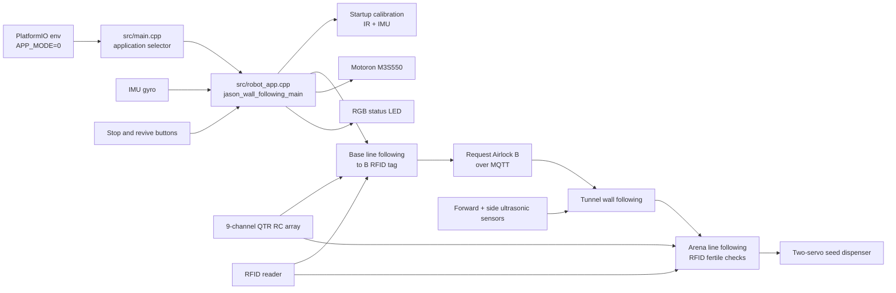
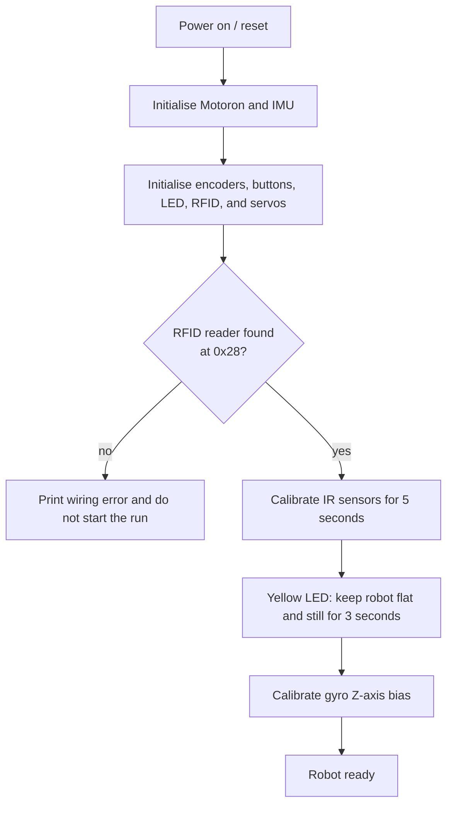
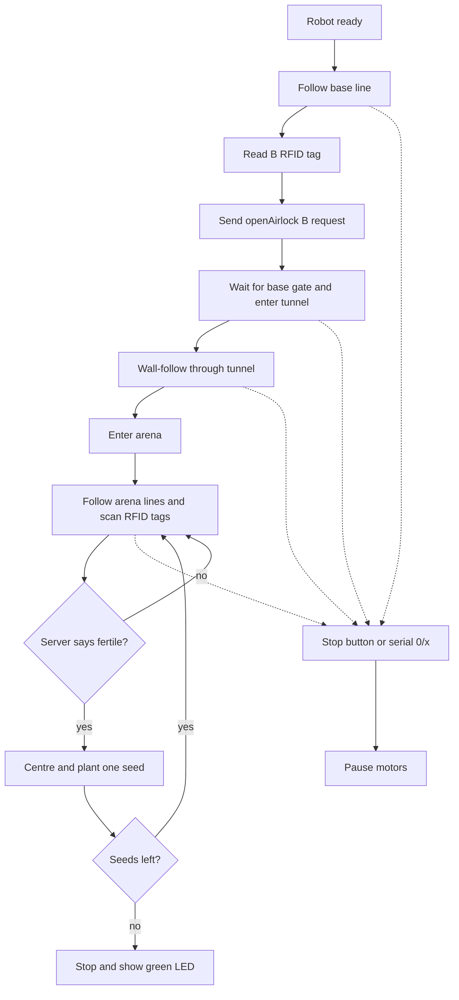
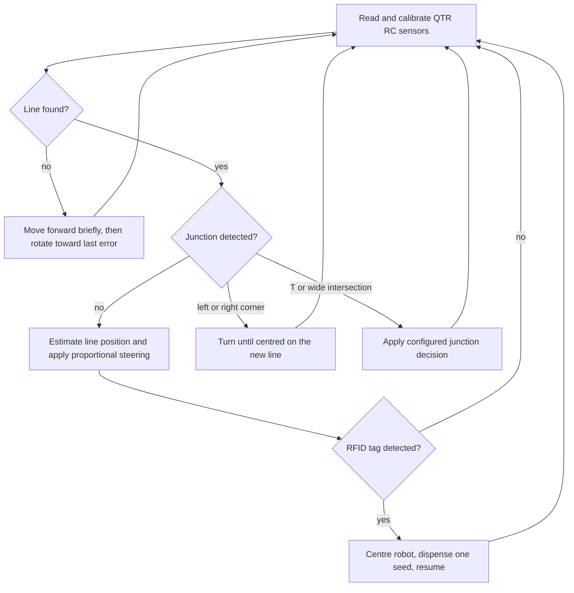

# Term 3 Autonomous Robot

Arduino GIGA R1 firmware for a differential-drive arena robot. The repository
contains the integrated robot software, focused hardware diagnostics, hardware
datasheets, planning material, and test logs.

## Final Demonstration Build

The assessed integrated build is:

| Item | Location |
| --- | --- |
| Final version | `jason_wall_following_main` |
| PlatformIO environment | `giga_r1_m7_robot` |
| Main implementation | [`src/robot_app.cpp`](src/robot_app.cpp) |
| Integrated source logic | [`Programming_Viva/`](Programming_Viva) |
| Application selector | [`src/main.cpp`](src/main.cpp) using `APP_MODE=0` |
| Build configuration | [`platformio.ini`](platformio.ini) |

`jason_wall_following_main` is the Easy difficulty autonomous build. After
startup calibration, the robot follows the base line to the `B` RFID tag,
requests Airlock B, wall-follows through the tunnel, enters the arena, scans
RFID tags, asks the server whether each tag is fertile, and plants up to five
seeds only on fertile locations.

Easy difficulty does not require emergency-return behaviour, light seeking, or
hard-mode obstacle/ramp handling.

## Setup

### Requirements

- Arduino GIGA R1 WiFi, using the M7 core
- PlatformIO Core or the PlatformIO VS Code extension
- USB cable for upload and serial monitoring
- A correctly wired Motoron M3S550 motor controller and separate motor supply
- Robot wheels raised off the floor for the first motor test after wiring changes

PlatformIO installs the required Arduino libraries from [`platformio.ini`](platformio.ini)
when the project is built.

### Important Connections

The table below documents the connections used by the final implementation.

| Device | Connection |
| --- | --- |
| Motoron M3S550 | `Wire1`; left motor channel `1`, right motor channel `2` |
| Left wheel encoder | `A=28`, `B=26` |
| Right wheel encoder | `A=22`, `B=24` |
| QTR RC line sensors | pins `2, 3, 4, 5, 8, 9, 10, 11, 12` |
| RFID reader | `Wire1`, address `0x28` |
| Upper and lower dispenser servos | pins `36`, `38` |
| RGB status LED | red `39`, green `35`, blue `37` |
| Stop button | pin `33`, active low |
| Revive button | pin `13`, active low |
| Ultrasonic sensor reserved pins | trigger `52`, echo `53` |
| Side ultrasonic sensor reserved pins | trigger `47`, echo `46` |

Before connecting motor power, verify the Motoron `VIN`, `GND`, `M1A/M1B`,
and `M2A/M2B` wiring. USB power does not replace the Motoron motor supply.

## Build, Upload, and Run

Open a terminal in the repository root.

Build the final demonstration firmware:

```powershell
platformio run -e giga_r1_m7_robot
```

Upload it:

```powershell
platformio run -e giga_r1_m7_robot -t upload
```

The upload helper waits for DFU mode. If prompted, double-tap the Arduino GIGA
`RESET` button until the `BOOT0` LED is green.

Open the serial monitor:

```powershell
platformio device monitor -b 115200
```

For the `jason_wall_following_main` build:

1. Place the robot at the base start position with the correct initial heading.
2. During the first five seconds, move the IR array over both the floor and a
   line so the sensors can calibrate.
3. When the LED turns yellow, place the robot flat and keep it still while the
   IMU gyro bias is calibrated.
4. The robot automatically starts the Easy flow: base line following, tunnel
   wall following, then arena RFID planting.
5. Press the stop button at any time to pause motion; press it again to resume.

Serial controls:

| Command | Action |
| --- | --- |
| `0` or `x` | Pause/resume the Easy flow |
| `r` | Restart the Easy flow from the base-line stage |
| `d` | Manually dispense one seed |

## Software Overview



### Startup Flow



### Easy Difficulty Flow



The Easy flow reuses the `Programming_Viva` modules for line following, IMU
turning, RFID, MQTT messages, tunnel wall following, and seed dispensing. The
PlatformIO wrapper in [`src/robot_app.cpp`](src/robot_app.cpp) makes that logic
the default `APP_MODE=0` application.

### Line-Following Flow



## Repository Structure

| Path | Purpose |
| --- | --- |
| [`src/`](src) | Integrated application and focused hardware test applications |
| [`src/robot_app.cpp`](src/robot_app.cpp) | Final `jason_wall_following_main` Easy difficulty implementation |
| [`src/main.cpp`](src/main.cpp) | Compile-time `APP_MODE` dispatcher |
| [`Programming_Viva/`](Programming_Viva) | Integrated Arduino modules reused by the final build |
| [`include/`](include) | Shared headers and earlier Arduino prototype sketches |
| [`Old/scripts/`](Old/scripts) | Archived PlatformIO upload helpers and monitoring utilities |
| [`electronics/`](electronics) | Electronics notes |
| [`docs/datasheet/`](docs/datasheet) | Component datasheets |
| [`docs/planning/`](docs/planning) | Design sketches and planning material |
| [`docs/test_logs/`](docs/test_logs) | Recorded test results |
| [`cad/`](cad) | Mechanical CAD files and exports |
| [`Old/waveform_figures_fixed/`](Old/waveform_figures_fixed) | Archived signal-path and waveform figures |

## Useful Diagnostic Builds

Use focused environments while commissioning hardware. Start with the wheels
raised whenever a build can drive the motors.

| Environment | Purpose |
| --- | --- |
| `giga_r1_m7_arduino_test` | Arduino USB, serial, LED, and analogue-input smoke test |
| `giga_r1_m7_motor_test` | Motoron I2C scan and motor-controller diagnostics |
| `giga_r1_m7_individual_wheel_test` | Run one wheel at a time in both directions and print encoder counts |
| `giga_r1_m7_encoder_test` | Encoder-only diagnostics |
| `giga_r1_m7_qtr_test` | QTR sensor test |
| `giga_r1_m7_rfid_test` | RFID bus and reader test |
| `giga_r1_m7_servo_test` | Seed-dispenser servo test |
| `giga_r1_m7_imu_test` | IMU detection, calibration, and turn diagnostics |

Build any diagnostic environment with:

```powershell
platformio run -e <environment_name>
```

## Calibration Notes

The line-following, tunnel, and turning parameters are empirical and must be
checked after mechanical, wiring, wheel, or battery changes. Commission the
robot incrementally:

1. Confirm each motor direction and encoder direction with
   `giga_r1_m7_individual_wheel_test`.
2. Test the QTR/IR array and tune thresholds if line detection is unstable.
3. Confirm RFID detection at the base `B` tag and arena tags.
4. Test left and right 90-degree IMU turns independently.
5. Test tunnel forward and side ultrasonic readings before driving through the
   airlock.
6. Run the full `jason_wall_following_main` Easy flow with the robot watched
   closely and the stop button reachable.
