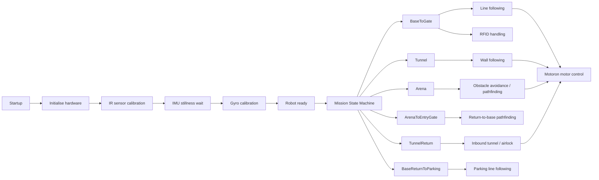
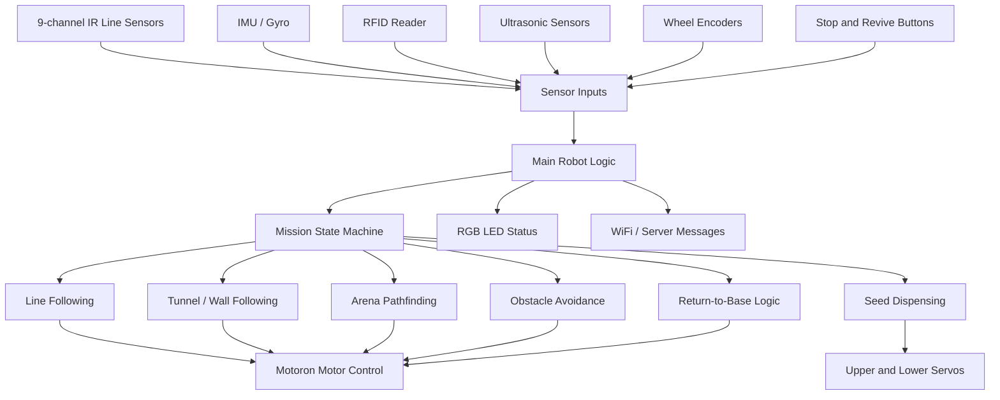
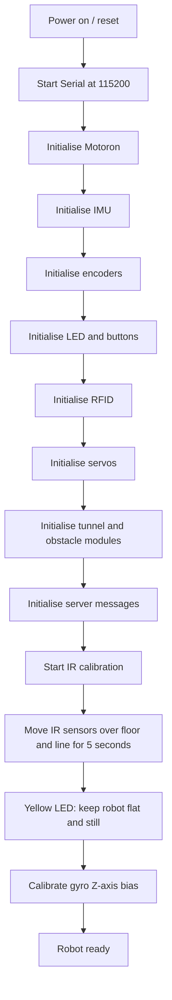
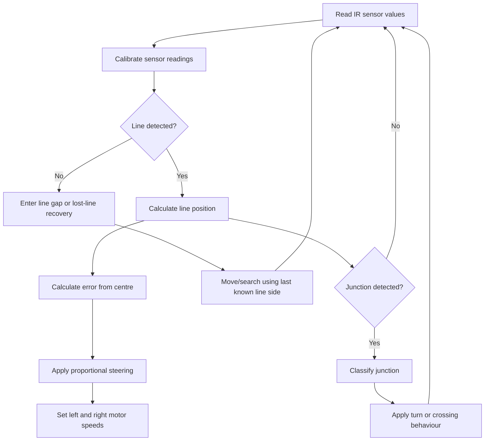
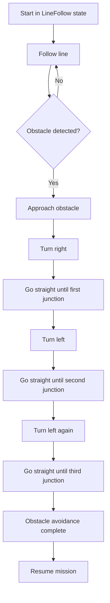
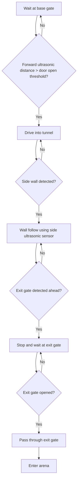
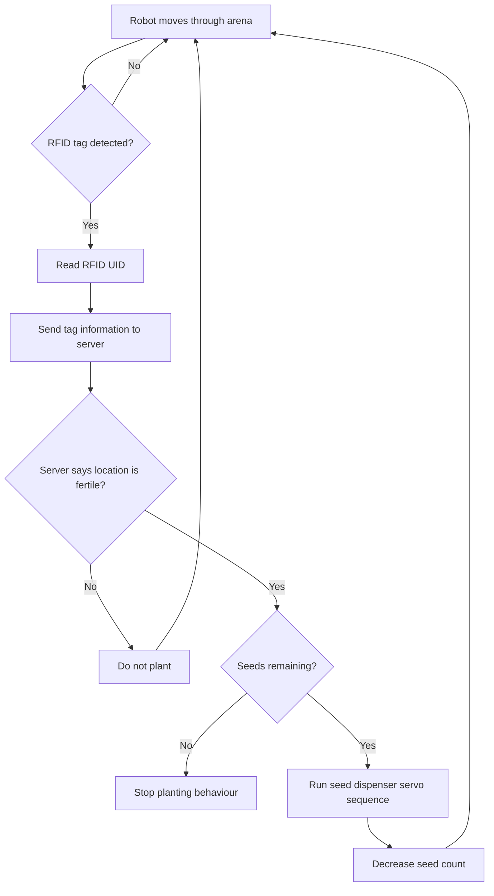
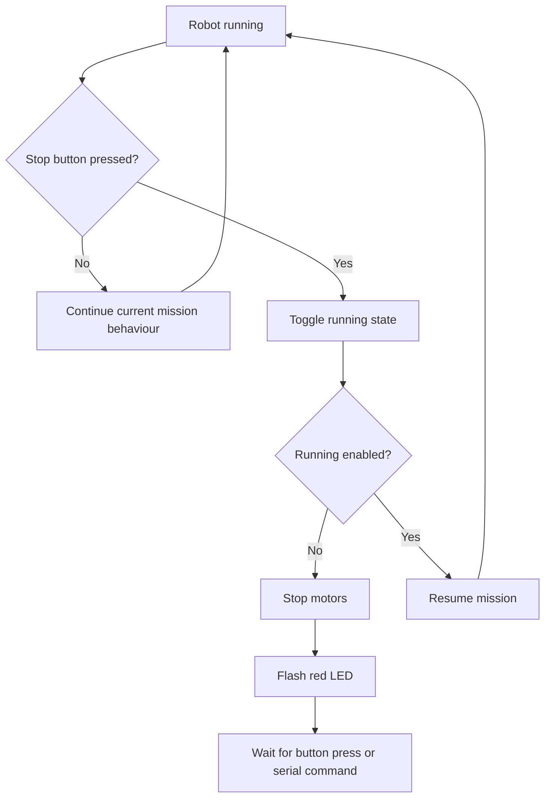
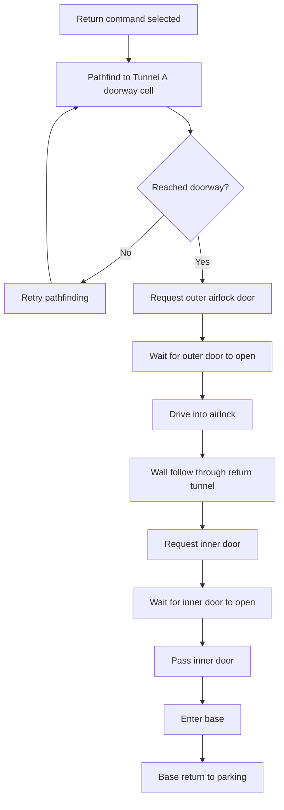

# Term 3 Autonomous Robot

This repository contains the software, documentation, diagrams, and testing evidence for our Term 3 autonomous robot project.

The robot is an Arduino GIGA R1 based differential-drive robot designed for the robotics challenge. The software integrates line following, IMU-based turning, RFID reading, server communication, obstacle avoidance, tunnel/airlock handling, emergency stop behaviour, and seed dispensing.

---

## Final Viva/Test Run Version

The final code version used for the viva/test run is:

```text
Jason_combined_code/
```

The main file for the final integrated version is:

```text
Jason_combined_code/Main.ino
```

This folder is treated as the final assessed software version for the viva/test run.

The `Jason_combined_code` folder contains the combined Arduino `.ino` files for the full robot behaviour, including:

| File | Purpose |
|---|---|
| `Main.ino` | Main setup, loop, mission state machine, startup calibration, and high-level robot control |
| `ArenaPathfinding.ino` | Arena pathfinding and navigation logic |
| `ArenaTypes.h` | Shared arena data structures and types |
| `IMU.ino` | IMU setup, gyro calibration, and turn-angle tracking |
| `LineSensors.ino` | 9-channel line sensor reading, calibration, line following, and junction detection |
| `MotorEncoders.ino` | Motor encoder counting and distance/position feedback |
| `RobotBehaviour.ino` | General robot behaviour functions |
| `ObstacleAvoid.ino` | Obstacle avoidance behaviour and swerve sequence |
| `RFID.ino` | RFID reader setup and tag handling |
| `RFIDServerTest.ino` | RFID-to-server test routine |
| `Messages.ino` | WiFi/MQTT/server communication logic |
| `Servos.ino` | Seed dispenser servo control |
| `LEDs.ino` | RGB LED status functions |
| `Printing.ino` | Serial debugging and status print functions |
| `Turning.ino` | IMU-based turning functions |
| `Test8.ino` | Revival mission / Test 8 behaviour |

---

## Repository Structure

```text
term3_robot/
├── Jason_combined_code/       Final viva/test run code
├── Jason_wall_following_main/ Earlier wall-following version
├── Main/                      Earlier or alternative main code
├── Programming_Viva/          Earlier viva/programming modules
├── Test3/                     Test code
├── Test8/                     Test 8 / revival related code
├── Old/                       Archived code and older versions
├── cad/                       CAD and mechanical design files
├── docs/                      Documentation, planning, datasheets, and test logs
├── include/                   Header files and shared definitions
├── src/                       PlatformIO source files and earlier application structure
├── platformio.ini             PlatformIO build configuration
├── RacetrackLineFollower.ino  Earlier line-following test code
└── README.md                  Repository guide
```

---

## Hardware Platform

The robot uses the following main hardware components:

| Component | Purpose |
|---|---|
| Arduino GIGA R1 WiFi | Main microcontroller |
| Motoron motor controller | Drives the left and right DC motors |
| DC motors with encoders | Differential-drive movement and encoder feedback |
| 9-channel QTR/IR sensor array | Line following and junction detection |
| IMU | Gyro-based turning and heading estimation |
| RFID reader | Reads arena/base RFID tags |
| Ultrasonic sensors | Tunnel and wall-following distance sensing |
| Two servos | Seed dispenser mechanism |
| RGB LED | Robot status indication |
| Mechanical stop button | Pause / kill-switch behaviour |
| Revive button | Revival behaviour trigger |

---

## Required Libraries

The final Arduino code uses the following main libraries:

```cpp
#include <Arduino.h>
#include <Wire.h>
#include <Motoron.h>
#include <math.h>
#include <MFRC522_I2C.h>
```

Required external libraries:

| Library | Purpose |
|---|---|
| `Motoron` | Communication with the Motoron motor controller |
| `MFRC522_I2C` | RFID reader communication over I2C |
| `Wire` | I2C communication |
| Arduino core libraries | General Arduino GIGA R1 functions |

Before compiling, make sure these libraries are installed in Arduino IDE or PlatformIO.

---

## Setup Steps

### 1. Clone or Download the Repository

```bash
git clone <repository-url>
```

Open the repository folder on your computer.

---

### 2. Open the Final Code

Open the following file in Arduino IDE:

```text
Jason_combined_code/Main.ino
```

Arduino IDE should automatically load the other `.ino` files in the same folder as tabs.

The final code depends on all files inside:

```text
Jason_combined_code/
```

Do not upload only `Main.ino` by itself without the other files in the same folder.

---

### 3. Select Board and Port

In Arduino IDE:

```text
Board: Arduino GIGA R1 WiFi
Port: Select the connected Arduino port
```

Use the M7 core if the IDE asks for the target core.

---

### 4. Install Required Libraries

Install these libraries through Arduino Library Manager or manually:

```text
Motoron
MFRC522_I2C
```

The built-in Arduino libraries such as `Wire` and `Arduino.h` should already be available.

---

### 5. Check WiFi / Server Settings

The code contains WiFi and server communication settings for the robotics challenge environment.

Before uploading, check the WiFi SSID, WiFi password, UDP/MQTT/server settings, and RFID/server communication settings.

For security, real WiFi credentials should not be shared in a public repository. If the repository is public, replace private credentials with placeholders such as:

```cpp
constexpr const char* WIFI_SSID = "YOUR_WIFI_SSID";
constexpr const char* WIFI_PASSWORD = "YOUR_WIFI_PASSWORD";
```

---

### 6. Upload the Code

Connect the Arduino GIGA R1 to the computer with a USB cable.

In Arduino IDE:

```text
Click Upload
```

After uploading, open Serial Monitor at:

```text
115200 baud
```

---

## How to Run the Robot

1. Place the robot at the correct starting position.
2. Turn on the robot power system.
3. Connect the Arduino GIGA R1 to the computer if Serial Monitor is needed.
4. Upload the final code from `Jason_combined_code/`.
5. Open Serial Monitor at `115200`.
6. During startup, the robot runs calibration:
   - IR sensor calibration
   - IMU stillness wait
   - Gyro Z-axis bias calibration
7. After calibration, the robot enters its mission state machine.
8. The robot can perform behaviours such as:
   - base line following
   - tunnel entry
   - wall following
   - arena behaviour
   - RFID scanning
   - obstacle avoidance
   - seed dispensing
   - return-to-base sequence
   - emergency stop / pause behaviour

---

## Serial Controls

The final integrated code includes serial commands for testing and selecting behaviours.

| Command | Action |
|---|---|
| `0` | Toggle running / paused state |
| `9` | Run RFID server test |
| `8` | Reset and select obstacle avoidance sequence |
| `4` | Trigger return-to-base sequence |
| `7` | Run Test 8 / revival mission |

---

## Main Software Overview

The final version is organised around a mission-level state machine in `Main.ino`.



---

## Main Software Components



---

## Startup and Calibration Flow



---

## Line Following Flow



---

## Obstacle Avoidance Flow



---

## Tunnel / Wall Following Flow



---

## RFID / Planting Flow



---

## Emergency Stop / Kill Switch Flow



---

## Return-to-Base Flow



---

## Testing and Calibration Evidence

Testing evidence is stored in the documentation folders and may include notes, screenshots, logs, and test results.

Recommended evidence to include in `docs/test_logs/`:

```text
docs/test_logs/
├── imu_calibration_log.md
├── line_following_test_log.md
├── motor_encoder_test_log.md
├── rfid_server_test_log.md
├── obstacle_avoidance_test_log.md
├── tunnel_wall_following_test_log.md
├── seed_dispenser_test_log.md
└── final_viva_test_log.md
```

Each test log should include:

```text
Date:
Test name:
Code version:
Hardware setup:
Parameters used:
What worked:
What did not work:
Changes made:
Final result:
```

Example:

```text
Test name: RFID server test
Code version: Jason_combined_code
Result: RFID tag was detected and the robot sent the tag information to the server.
What worked: RFID UID reading and serial output.
What did not work: Server response was inconsistent during some runs.
Change made: Added cooldown time between RFID scans.
```

---

## Calibration Notes

The robot requires calibration before reliable operation.

Main calibration steps:

1. IR line sensors:
   - Move the sensor array over both the floor and the black line during startup.
   - The calibration lasts around 5 seconds.
   - This improves line detection and junction classification.

2. IMU gyro:
   - Place the robot flat and still when the yellow LED is shown.
   - The robot measures gyro Z-axis bias.
   - This improves turning accuracy.

3. Ultrasonic sensors:
   - Check forward and side distance readings before tunnel tests.
   - Verify that the wall-following distance threshold is suitable.

4. Motor direction:
   - Test left and right motors separately after wiring changes.
   - Keep the wheels raised during the first motor test.

5. RFID:
   - Confirm that the RFID reader can detect known tags.
   - Check that RFID readings are sent correctly to the server.

6. Seed dispenser:
   - Test upper and lower servo angles before loading seeds.
   - Confirm that only one seed is released per planting cycle.

---

## Known Limitations

The final integrated code combines several behaviours into one Arduino project. Some modules were tested more heavily than others.

Known limitations:

- Fine movement may vary depending on battery level, floor friction, and wheel alignment.
- Line following can become unstable if the lighting changes or if the line sensor calibration is poor.
- RFID detection depends on tag position and reader distance.
- Ultrasonic readings can fluctuate near walls, corners, or angled surfaces.
- Obstacle avoidance and pathfinding may require manual reset if the robot starts from an unexpected pose.
- WiFi/server communication depends on the challenge network and server availability.
- Some older folders in the repository are archived prototypes and should not be treated as the final assessed version.

---

## Final Submission Checklist

The GitHub repository includes the following required submission contents:

- [x] Latest code version
- [x] Final viva/test run code clearly identified as `Jason_combined_code/`
- [x] README explaining repository structure
- [x] Required libraries listed
- [x] Setup and upload instructions
- [x] Software overview diagram
- [x] Flowcharts for key behaviours
- [x] Testing/calibration evidence section
- [x] Notes on what worked and what did not work

---

## Important Note for Assessors

The final assessed code is located in:

```text
Jason_combined_code/
```

Please use this folder as the final viva/test run version.

Other folders such as `Old/`, `Test3/`, `Test8/`, `Programming_Viva/`, `Jason_wall_following_main/`, `src/`, and `Main/` are kept for reference, testing, diagnostics, or earlier development history.
