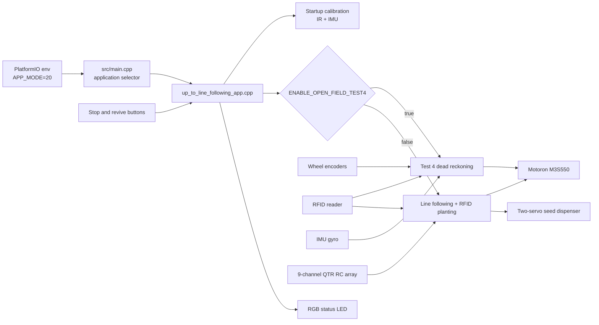
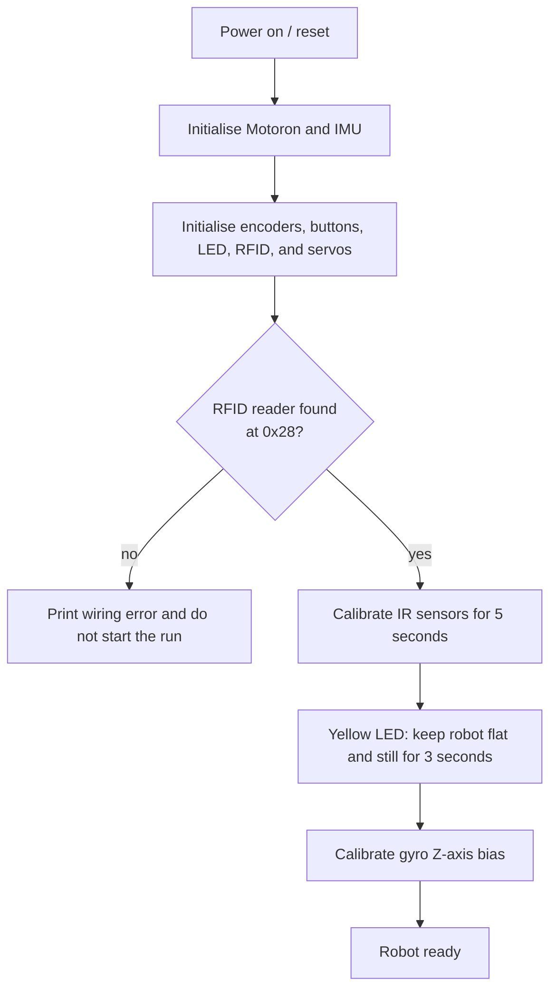
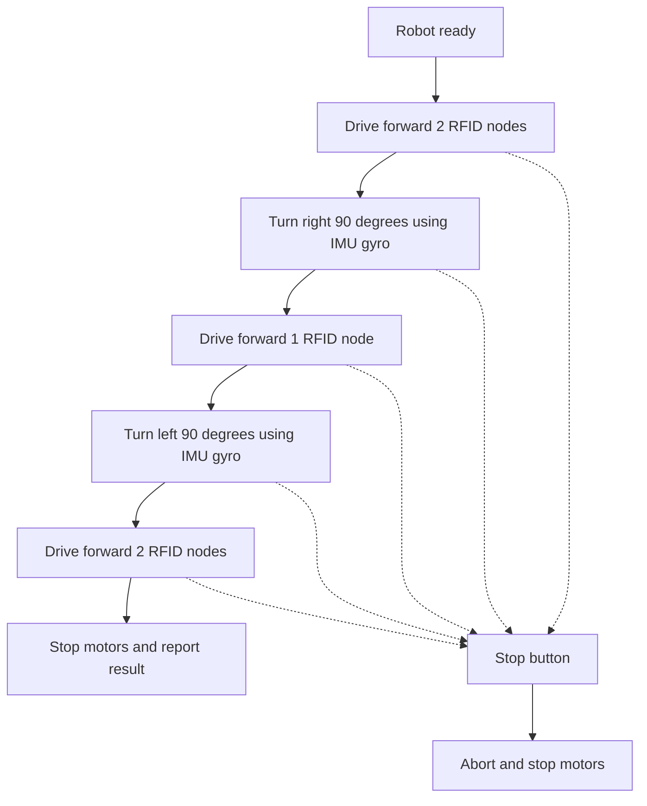
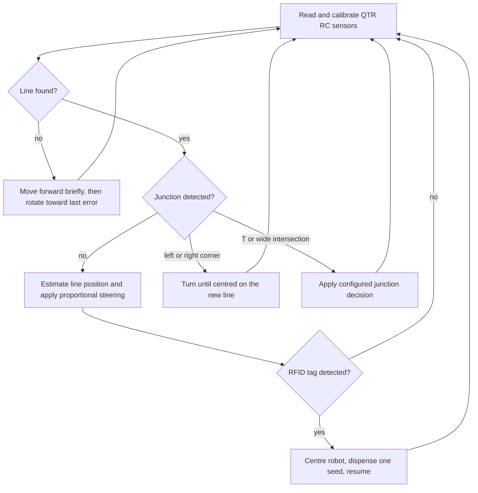

# Term 3 Autonomous Robot

Arduino GIGA R1 firmware for a differential-drive arena robot. The repository
contains the integrated robot software, focused hardware diagnostics, hardware
datasheets, planning material, and test logs.

## Final Demonstration Build

The assessed integrated build is:

| Item | Location |
| --- | --- |
| PlatformIO environment | `giga_r1_m7_up_to_line_following_test` |
| Main implementation | [`src/up_to_line_following_app.cpp`](src/up_to_line_following_app.cpp) |
| Application selector | [`src/main.cpp`](src/main.cpp) using `APP_MODE=20` |
| Build configuration | [`platformio.ini`](platformio.ini) |

The current configuration has `ENABLE_OPEN_FIELD_TEST4 = true`. After startup
calibration, the robot runs the Test 4 open-field dead-reckoning manoeuvre once
and then stops:

```text
forward 2 nodes -> right 90 degrees -> forward 1 node
-> left 90 degrees -> forward 2 nodes -> stop
```

Set `ENABLE_OPEN_FIELD_TEST4` to `false` in
[`src/up_to_line_following_app.cpp`](src/up_to_line_following_app.cpp) to run
the line-following and RFID-triggered seed-dispensing behaviour instead.

## Setup

### Requirements

- Arduino GIGA R1 WiFi, using the M7 core
- PlatformIO Core or the PlatformIO VS Code extension
- USB cable for upload and serial monitoring
- A correctly wired Motoron M3S550 motor controller and separate motor supply
- Robot wheels raised off the floor for the first motor test after wiring changes

PlatformIO installs the required Arduino libraries from [`platformio.ini`](platformio.ini)
when the project is built.

### Important Connections

The table below documents the connections used by the final implementation.

| Device | Connection |
| --- | --- |
| Motoron M3S550 | `Wire1`; left motor channel `1`, right motor channel `2` |
| Left wheel encoder | `A=28`, `B=26` |
| Right wheel encoder | `A=22`, `B=24` |
| QTR RC line sensors | pins `2, 3, 4, 5, 8, 9, 10, 11, 12` |
| RFID reader | `Wire1`, address `0x28` |
| Upper and lower dispenser servos | pins `36`, `38` |
| RGB status LED | red `39`, green `35`, blue `37` |
| Stop button | pin `33`, active low |
| Revive button | pin `13`, active low |
| Ultrasonic sensor reserved pins | trigger `52`, echo `53` |
| Side ultrasonic sensor reserved pins | trigger `47`, echo `46` |

Before connecting motor power, verify the Motoron `VIN`, `GND`, `M1A/M1B`,
and `M2A/M2B` wiring. USB power does not replace the Motoron motor supply.

## Build, Upload, and Run

Open a terminal in the repository root.

Build the final demonstration firmware:

```powershell
platformio run -e giga_r1_m7_up_to_line_following_test
```

Upload it:

```powershell
platformio run -e giga_r1_m7_up_to_line_following_test -t upload
```

The upload helper waits for DFU mode. If prompted, double-tap the Arduino GIGA
`RESET` button until the `BOOT0` LED is green.

Open the serial monitor:

```powershell
platformio device monitor -b 115200
```

For the current Test 4 build:

1. Place the robot at the start position with the correct initial heading.
2. During the first five seconds, move the IR array over both the floor and a
   line so the sensors can calibrate.
3. When the LED turns yellow, place the robot flat and keep it still while the
   IMU gyro bias is calibrated.
4. The robot then performs the three-leg manoeuvre once and stops.
5. Press the stop button at any time to abort motion.

## Software Overview



### Startup Flow



### Test 4 Open-Field Flow



Each straight leg uses wheel-encoder feedback. The controller compares the
absolute left and right encoder increments and adjusts the two wheel commands
to reduce drift. RFID tags provide node-level position checks. After a tag is
read, the robot advances a short calibrated distance so its centre aligns with
the node. Each turn integrates the IMU gyroscope Z-axis rate until the target
angle is reached.

The main Test 4 tuning constants are grouped near `ENABLE_OPEN_FIELD_TEST4` in
[`src/up_to_line_following_app.cpp`](src/up_to_line_following_app.cpp):

| Parameter | Current value | Purpose |
| --- | ---: | --- |
| `OPEN_FIELD_COUNTS_PER_NODE` | `2400` | Encoder counts expected per arena node |
| `OPEN_FIELD_BASE_SPEED` | `160` | Straight-line motor command |
| `OPEN_FIELD_ENCODER_KP` | `0.08` | Left/right encoder correction gain |
| `OPEN_FIELD_HEADING_KP` | `0.0` | Optional IMU heading correction during straight legs |
| `TURN_90_TARGET_DEG` | `90.0` | IMU turn target |

### Line-Following Flow

This behaviour is implemented but bypassed while `ENABLE_OPEN_FIELD_TEST4` is
`true`.



## Repository Structure

| Path | Purpose |
| --- | --- |
| [`src/`](src) | Integrated application and focused hardware test applications |
| [`src/up_to_line_following_app.cpp`](src/up_to_line_following_app.cpp) | Final integrated demonstration implementation |
| [`src/main.cpp`](src/main.cpp) | Compile-time `APP_MODE` dispatcher |
| [`include/`](include) | Shared headers and earlier Arduino prototype sketches |
| [`Old/scripts/`](Old/scripts) | Archived PlatformIO upload helpers and monitoring utilities |
| [`electronics/`](electronics) | Electronics notes |
| [`docs/datasheet/`](docs/datasheet) | Component datasheets |
| [`docs/planning/`](docs/planning) | Design sketches and planning material |
| [`docs/test_logs/`](docs/test_logs) | Recorded test results |
| [`cad/`](cad) | Mechanical CAD files and exports |
| [`Old/waveform_figures_fixed/`](Old/waveform_figures_fixed) | Archived signal-path and waveform figures |

## Useful Diagnostic Builds

Use focused environments while commissioning hardware. Start with the wheels
raised whenever a build can drive the motors.

| Environment | Purpose |
| --- | --- |
| `giga_r1_m7_arduino_test` | Arduino USB, serial, LED, and analogue-input smoke test |
| `giga_r1_m7_motor_test` | Motoron I2C scan and motor-controller diagnostics |
| `giga_r1_m7_individual_wheel_test` | Run one wheel at a time in both directions and print encoder counts |
| `giga_r1_m7_encoder_test` | Encoder-only diagnostics |
| `giga_r1_m7_qtr_test` | QTR sensor test |
| `giga_r1_m7_rfid_test` | RFID bus and reader test |
| `giga_r1_m7_servo_test` | Seed-dispenser servo test |
| `giga_r1_m7_imu_test` | IMU detection, calibration, and turn diagnostics |

Build any diagnostic environment with:

```powershell
platformio run -e <environment_name>
```

## Calibration Notes

The open-field parameters are empirical and must be checked after mechanical,
wiring, wheel, or battery changes. Commission the robot incrementally:

1. Confirm each motor direction and encoder direction with
   `giga_r1_m7_individual_wheel_test`.
2. Measure the encoder counts for one arena node and update
   `OPEN_FIELD_COUNTS_PER_NODE`.
3. Tune `OPEN_FIELD_ENCODER_KP` until a straight leg is stable without visible
   oscillation.
4. Confirm RFID detection and adjust the centre-after-RFID distance if needed.
5. Test left and right 90-degree IMU turns independently.
6. Run the full three-leg Test 4 manoeuvre.
