# Term 3 Autonomous Robot

This repository contains the software, documentation, diagrams, and testing evidence for our Term 3 robotics challenge robot.

The final integrated robot software is an Arduino GIGA R1 WiFi project. It combines line following, IMU-based turning, RFID reading, MQTT/server communication, ultrasonic wall following, obstacle avoidance, arena pathfinding, return-to-base logic, emergency stop behaviour, revive behaviour, and seed dispensing.

---

## Final Viva/Test Run Version

The final code version used for the viva/test run is:

```text
Jason_combined_code/
```

The main file for the final integrated version is:

```text
Jason_combined_code/Main.ino
```

This folder is treated as the final assessed software version for the viva/test run.

Important note:

```text
All `.ino` files inside Jason_combined_code/ are part of the same Arduino sketch.
Do not upload Main.ino alone without the other tabs/files in the same folder.
```

---

## Final Code Folder Contents

| File                   | Purpose                                                                                                                                                                                                                                                                                                                              |
| ---------------------- | ------------------------------------------------------------------------------------------------------------------------------------------------------------------------------------------------------------------------------------------------------------------------------------------------------------------------------------ |
| `Main.ino`             | Main integrated sketch. Defines configuration values, mission phases, global states, hardware pin assignments, tunnel logic, setup routine, calibration sequence, serial commands, stop/revive button handling, and the main mission state machine.                                                                                  |
| `ArenaTypes.h`         | Shared type definitions used by the arena and revive logic, including `ArenaPoint`, `ArenaHeading`, `RFIDLocation`, and `Test8ReviveTarget`.                                                                                                                                                                                         |
| `ArenaPathfinding.ino` | Arena navigation and path planning. Uses an 11x11 planning grid around the 9x9 playable arena, decodes the 21-byte server map, uses weighted Dijkstra pathfinding, updates pose from RFID/server replies, marks temporary obstacles, and drives cell-by-cell toward a target.                                                        |
| `Messages.ino`         | Non-blocking WiFi/MQTT communication layer. Handles WiFi reconnects, MQTT reconnects, topic building, incoming messages, map updates, fertility/location replies, revive broadcasts, emergency/disable messages, heartbeat/register messages, and server requests such as `isFertile`, `getMap`, `openAirlock`, and `reviveRequest`. |
| `IMU.ino`              | IMU setup and gyro handling. Selects the best I2C bus, detects ADXL345, ITG320x, HMC5883L/QMC5883L, and BMP280, calibrates gyro Z-axis bias, integrates turn angle, and prints IMU status.                                                                                                                                           |
| `LineSensors.ino`      | 9-channel RC/QTR line sensor reading and calibration. Handles line detection, line position estimation, junction classification, line following, intersection crossing, gap recovery, and lost-line recovery.                                                                                                                        |
| `MotorEncoders.ino`    | Motor and encoder support. Handles left/right encoder interrupts, encoder reads, Motoron setup, motor speed commands, stop commands, forward driving, proportional line-following motor correction, and centring after RFID/IR detection.                                                                                            |
| `ObstacleAvoid.ino`    | Obstacle swerve state machine. Uses the forward ultrasonic sensor, line following without automatic junction turns, RFID-based junction detection, and scripted right/left turn sequence to move around an obstacle and return to the original trajectory.                                                                           |
| `RFID.ino`             | RFID reader setup and basic tag handling. Checks the RFID reader on I2C address `0x28`, validates firmware version, initialises the reader without soft reset, prints UID values, and triggers planting when a tag is detected in the simple RFID flow.                                                                              |
| `RFIDServerTest.ino`   | Manual and autonomous RFID/server helper. Provides `tryScanRFIDOnce()`, `scanRFIDAndQueryServer()`, and `runRFIDServerTest()`. The serial command `9` uses this to scan an RFID tag, send `isFertile`, wait for a server reply, and print UID, fertility, and x/y position.                                                          |
| `RobotBehaviour.ino`   | Higher-level helper functions. Provides `plant()`, stop-input checking during blocking tests, and RFID scanning for test routines. Some older scripted test flows were removed because the arena pathfinder and server-based planting logic replaced them.                                                                           |
| `Servos.ino`           | Seed dispenser servo control. Converts angles to pulse widths, manually services servo pulses, closes both gates, and runs the upper/lower gate sequence to dispense one seed.                                                                                                                                                       |
| `Test8.ino`            | Revive mission logic. Stores revive target broadcasts, selects a target, approaches using the forward ultrasonic sensor and line sensors if available, holds revive for 5 seconds, sends a revive request, then reverses until an RFID tag is found.                                                                                 |
| `Turning.ino`          | IMU-based turning functions. Provides left/right 90-degree and 180-degree turns using gyro angle integration and line reacquisition, plus angle-only turning with timeout and stop-input checking.                                                                                                                                   |
| `LEDs.ino`             | RGB LED helper functions for red, green, yellow, blue, and flashing red status indication.                                                                                                                                                                                                                                           |
| `Printing.ino`         | Serial debug output. Prints line-following state, junction type, line position, motor commands, calibrated sensor values, IMU status, encoder counts, and calibration data.                                                                                                                                                          |

---

## Repository Structure

```text
term3_robot/
├── Jason_combined_code/       Final viva/test run Arduino sketch
├── Jason_wall_following_main/ Earlier wall-following version
├── Main/                      Earlier or alternative main code
├── Programming_Viva/          Earlier viva/programming modules
├── Test3/                     Older test code
├── Test8/                     Older or separate Test 8 code
├── Old/                       Archived code and older versions
├── cad/                       Mechanical CAD files and exports
├── docs/                      Documentation, planning material, datasheets, and test logs
├── include/                   Header files and shared definitions
├── src/                       PlatformIO source files and earlier application structure
├── platformio.ini             PlatformIO build configuration
├── RacetrackLineFollower.ino  Earlier line-following test code
└── README.md                  Repository guide
```

Only `Jason_combined_code/` should be treated as the final viva/test run version.

Other folders are kept for reference, diagnostics, earlier prototypes, or development history.

---

## Hardware Platform

The final code is designed for an Arduino GIGA R1 WiFi based differential-drive robot.

| Component                          | Purpose                                                                 |
| ---------------------------------- | ----------------------------------------------------------------------- |
| Arduino GIGA R1 WiFi               | Main microcontroller                                                    |
| Motoron motor controller           | Controls the left and right drive motors                                |
| DC motors with encoders            | Differential-drive movement and encoder feedback                        |
| 9-channel RC/QTR line sensor array | Line following, line recovery, and junction detection                   |
| IMU / gyro                         | Turn-angle estimation and IMU-based turning                             |
| RFID reader                        | Reads arena/base RFID tags                                              |
| Forward ultrasonic sensor          | Gate detection, obstacle detection, and revive approach distance        |
| Side ultrasonic sensor             | Tunnel wall-following distance measurement                              |
| Upper and lower servos             | Seed dispenser gate mechanism                                           |
| RGB LED                            | Robot status indication                                                 |
| Mechanical stop button             | Pause / kill-switch behaviour                                           |
| Revive button                      | Revive/contact trigger behaviour                                        |
| WiFi/MQTT server link              | Map, fertility, airlock, heartbeat, emergency, and revive communication |

---

## Important Pin and Address Configuration

The final configuration is defined mainly in `Main.ino`.

| Item                            | Configuration                  |
| ------------------------------- | ------------------------------ |
| Top RGB LED red                 | Pin `39`                       |
| Top RGB LED green               | Pin `35`                       |
| Top RGB LED blue                | Pin `37`                       |
| Mechanical stop button          | Pin `33`, active low           |
| Revive button                   | Pin `13`, active low           |
| Line sensor pins                | `2, 3, 4, 5, 8, 9, 10, 11, 12` |
| Left encoder                    | `A = 28`, `B = 26`             |
| Right encoder                   | `A = 22`, `B = 24`             |
| RFID reader                     | I2C address `0x28`, on `Wire1` |
| Motoron controller              | I2C address `0x10`, on `Wire1` |
| Upper seed servo                | Pin `36`                       |
| Lower seed servo                | Pin `38`                       |
| Forward ultrasonic trigger/echo | Trigger `52`, echo `53`        |
| Side ultrasonic trigger/echo    | Trigger `47`, echo `46`        |
| Serial baud rate                | `115200`                       |

---

## Required Libraries

The final Arduino code uses these main libraries:

```cpp
#include <Arduino.h>
#include <Wire.h>
#include <Motoron.h>
#include <math.h>
#include <MFRC522_I2C.h>
#include "ArenaTypes.h"
```

The messaging layer also uses WiFi/MQTT-related Arduino networking functionality.

Before compiling, make sure the following are available in Arduino IDE or PlatformIO:

| Library / Dependency          | Purpose                                |
| ----------------------------- | -------------------------------------- |
| Arduino GIGA R1 board package | Arduino GIGA R1 WiFi support           |
| `Wire`                        | I2C communication                      |
| `Motoron`                     | Motoron motor controller communication |
| `MFRC522_I2C`                 | RFID reader communication over I2C     |
| Arduino WiFi / MQTT support   | Server communication in `Messages.ino` |
| Arduino core libraries        | General Arduino functions              |

---

## Setup Steps

### 1. Clone or Download the Repository

```bash
git clone <repository-url>
```

Open the repository folder on your computer.

---

### 2. Open the Final Code

Open this file in Arduino IDE:

```text
Jason_combined_code/Main.ino
```

Arduino IDE should automatically load the other `.ino` files in `Jason_combined_code/` as tabs.

The final code depends on the full folder:

```text
Jason_combined_code/
```

Do not move `Main.ino` out of this folder unless all related `.ino` files and `ArenaTypes.h` are moved with it.

---

### 3. Select Board and Port

In Arduino IDE:

```text
Board: Arduino GIGA R1 WiFi
Port: Select the connected Arduino port
```

Use the M7 core if the IDE asks for the target core.

---

### 4. Install Required Libraries

Install the required external libraries through Arduino Library Manager or manually:

```text
Motoron
MFRC522_I2C
```

Also make sure the Arduino GIGA R1 WiFi board package and WiFi/MQTT dependencies are installed.

---

### 5. Check WiFi and Server Settings

The final code contains WiFi and MQTT/server settings for the robotics challenge environment.

Before uploading, check:

```text
WiFi SSID
WiFi password
MQTT broker address
Team ID
Board ID
Server board ID
Airlock/server message format
```

Security warning:

```text
Do not leave real WiFi credentials in a public GitHub repository.
```

If the repository is public, replace real credentials with placeholders, for example:

```cpp
constexpr const char* WIFI_SSID = "YOUR_WIFI_SSID";
constexpr const char* WIFI_PASSWORD = "YOUR_WIFI_PASSWORD";
```

Then document the real credentials privately for the team.

---

### 6. Upload the Code

Connect the Arduino GIGA R1 to the computer with a USB cable.

In Arduino IDE:

```text
Click Upload
```

After uploading, open Serial Monitor at:

```text
115200 baud
```

---

## How to Run the Robot

1. Place the robot at the correct start position.
2. Turn on the robot power system.
3. Connect the Arduino GIGA R1 to the computer if Serial Monitor is needed.
4. Upload the final code from `Jason_combined_code/`.
5. Open Serial Monitor at `115200`.
6. During startup, the robot runs calibration:

   * IR line sensor calibration
   * IMU stillness wait
   * Gyro Z-axis bias calibration
7. After calibration, the robot enters the mission state machine.
8. The default mission phase in the final code starts from `BaseToGate`.
9. The robot then follows the configured mission logic:

   * base line following
   * RFID handling
   * tunnel entry
   * wall following
   * arena behaviour
   * obstacle avoidance fallback
   * pathfinding if an arena goal is set
   * return-to-base if commanded
   * revive behaviour if commanded
   * seed dispensing when planting is triggered

---

## Serial Controls

The final integrated code includes serial commands for testing and selecting behaviours.

| Command    | Action                                                                            |
| ---------- | --------------------------------------------------------------------------------- |
| `0`        | Toggle running / paused state                                                     |
| `9`        | Run RFID server test: scan one tag, send `isFertile`, and print UID/fertility/x/y |
| `8`        | Reset and select the obstacle avoidance sequence                                  |
| `4`        | Trigger return-to-base sequence through Tunnel A                                  |
| `7`        | Run Test 8 / revive mission                                                       |
| `x` or `X` | Stop during some blocking test routines                                           |

---

## Main Software Overview

The final version is organised around `Main.ino`, which initialises hardware, runs calibration, handles serial/buttons, and dispatches behaviours through a mission-level state machine.

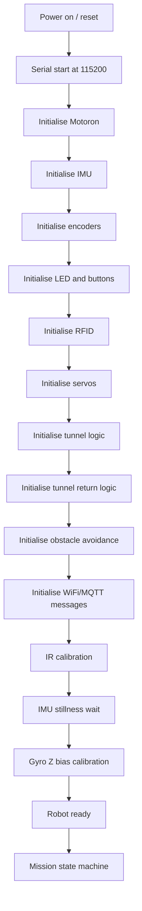

---

## Mission State Machine

The main mission phases are:

```text
BaseToGate
Tunnel
Arena
ArenaToEntryGate
TunnelReturn
BaseReturnToParking
```

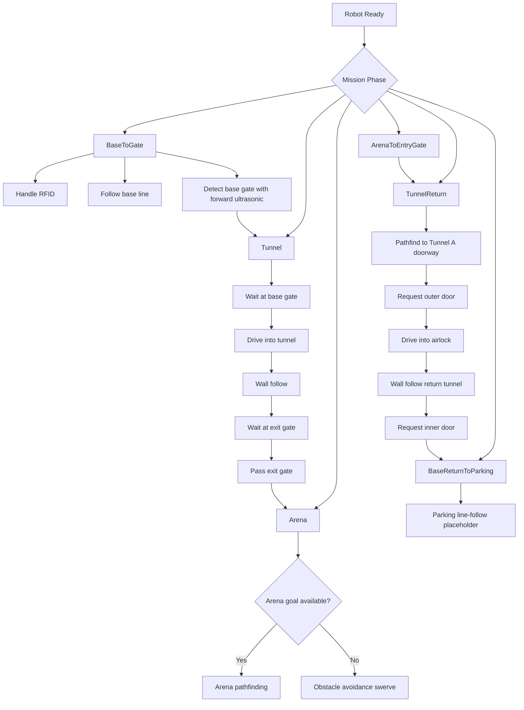

---

## Sensor and Actuator Software Architecture

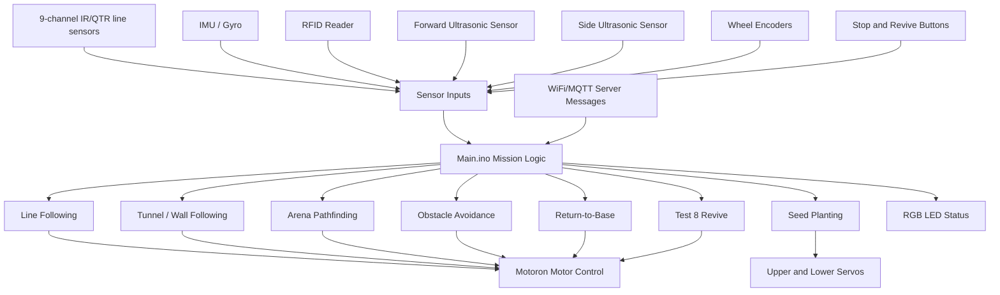

---

## Startup and Calibration Flow

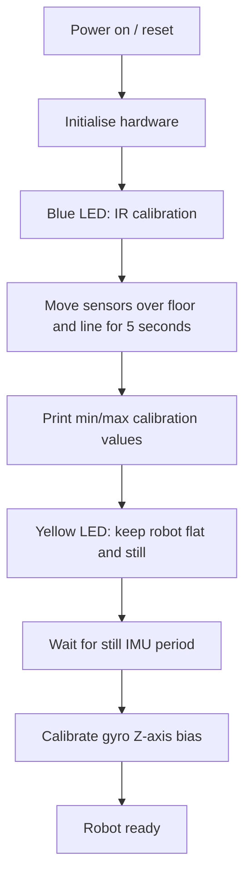

Calibration sequence:

| Stage                 | Description                                                               |
| --------------------- | ------------------------------------------------------------------------- |
| IR calibration        | Move the line sensor array over both floor and line for around 5 seconds. |
| IMU stillness wait    | Keep the robot flat and still when the LED is yellow.                     |
| Gyro bias calibration | The robot samples gyro Z-axis bias and uses it for turn-angle correction. |
| Ready                 | The robot enters the mission state machine after calibration finishes.    |

---

## Line Following Flow

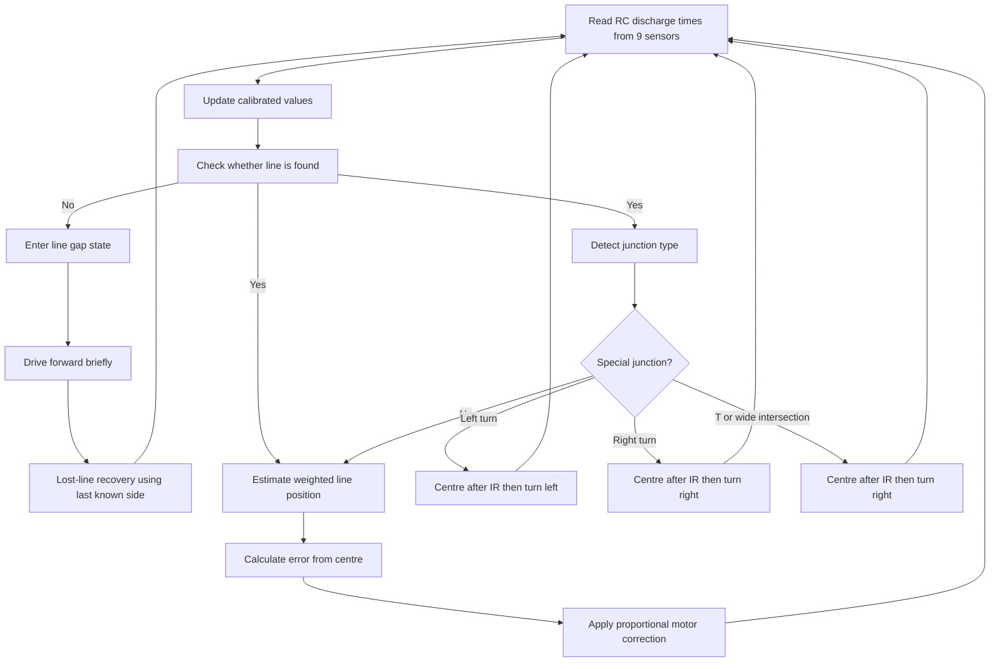

The line-following logic includes:

```text
Line detection threshold with hysteresis
Weighted line position estimation
Junction classification
Line gap recovery
Lost-line recovery
Proportional steering control
Turn recovery memory
```

---

## IMU Turning Flow

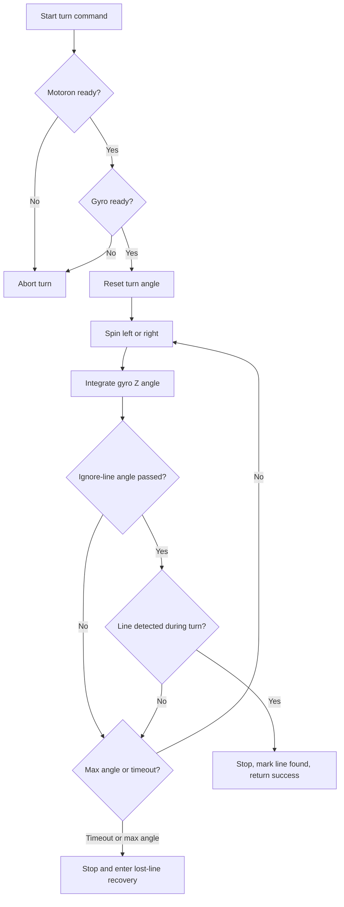

Turning functions:

```text
turnLeft90WithLines()
turnRight90WithLines()
turnLeft180WithLines()
turnRight180WithLines()
turnAngleOnly()
```

---

## Tunnel / Wall Following Flow

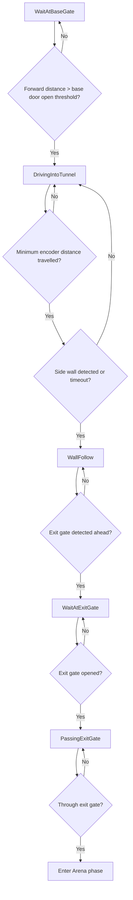

The wall-following controller uses the side ultrasonic sensor and a proportional correction:

```text
error = side_distance - target_side_distance
correction = WALL_KP * error
left_speed = base_speed - correction
right_speed = base_speed + correction
```

---

## Obstacle Avoidance Flow

`ObstacleAvoid.ino` implements a scripted swerve sequence around an obstacle.

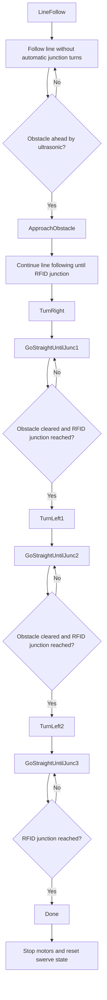

This behaviour relies on:

```text
Forward ultrasonic obstacle detection
RFID tag detection at junctions
Line following with junction turns suppressed
IMU/line-based 90-degree turns
```

---

## Arena Pathfinding Flow

`ArenaPathfinding.ino` provides weighted navigation for the arena.

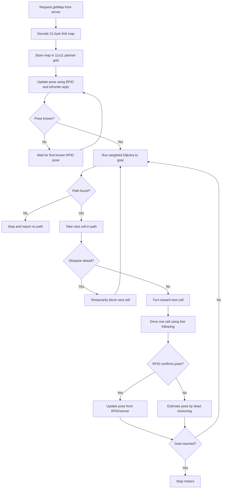

Map states:

```text
0 = unknown
1 = seeded
2 = fertile
3 = infertile
```

The pathfinder uses weighted costs so that explored cells and lower-y cells can be preferred, while unknown cells and temporary obstacles receive different costs.

---

## RFID and Server Flow

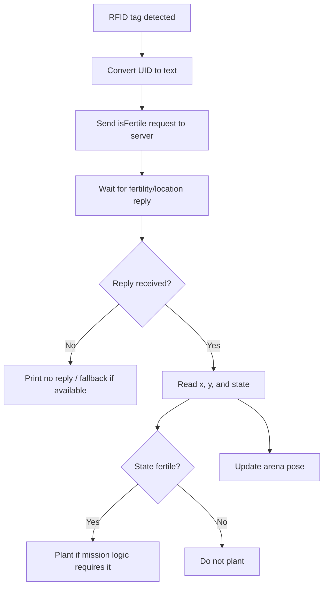

The `9` serial command runs a manual RFID/server diagnostic:

```text
Scan RFID tag
Send isFertile request
Wait for server reply
Print UID
Print server state
Print fertility
Print x/y coordinates
```

---

## Seed Dispensing Flow

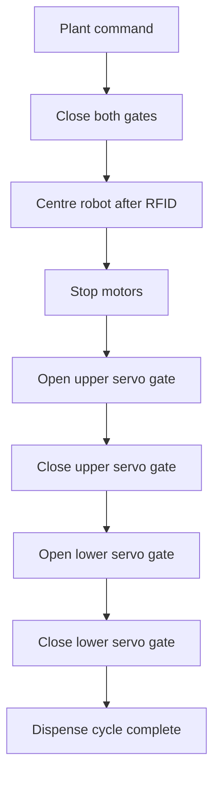

The dispenser uses two servos:

```text
Upper servo: controls seed loading gate
Lower servo: controls seed release gate
```

Servo pulses are manually serviced using `serviceServoPulses()` instead of relying on a standard Servo library.

---

## Return-to-Base Flow

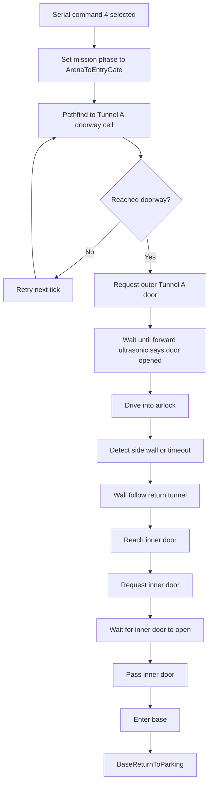

Current limitation:

```text
BaseReturnToParking is still a placeholder and currently uses general line following.
```

---

## Test 8 / Revive Flow

`Test8.ino` implements a revive mission using server revive broadcasts, forward ultrasonic distance, line sensors, and the revive button.

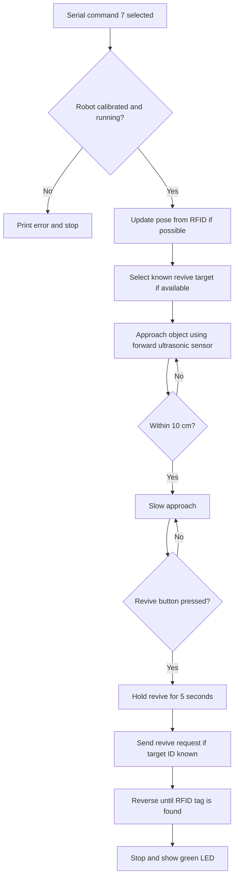

Test 8 can still operate in a distance-sensor-only mode if no server revive target is known.

---

## Stop / Emergency Behaviour

The final code includes both physical and software stop handling.

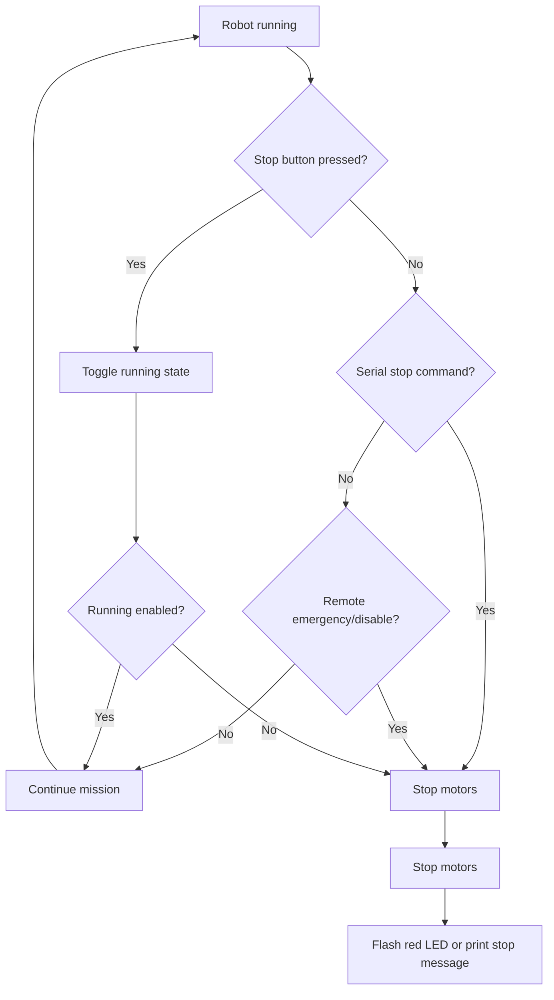

Stop inputs are checked in the main loop and inside some blocking test routines such as turning, pathfinding, and revive behaviour.

---

## Testing and Calibration Evidence

Testing and calibration evidence is stored in:

```text
docs/test_logs/
├── final_viva_test_log.md

---

## Calibration Notes

The robot requires calibration before reliable operation.

Main calibration steps:

1. IR line sensors:

   * Move the sensor array over both the floor and the line during startup.
   * The calibration lasts around 5 seconds.
   * This improves line detection, line position estimation, and junction classification.

2. IMU gyro:

   * Place the robot flat and still when the LED is yellow.
   * The robot samples the gyro Z-axis bias.
   * This improves IMU-based turning.

3. Motor and encoder direction:

   * Test each motor direction after wiring changes.
   * Test encoder direction before using encoder-based centring or tunnel movement.
   * Keep the robot wheels raised during first motor tests.

4. Ultrasonic sensors:

   * Check forward and side distance readings before tunnel and obstacle tests.
   * Confirm that distance thresholds match the actual arena setup.

5. RFID reader:

   * Confirm the reader is detected at I2C address `0x28`.
   * Confirm known tags can be read reliably.
   * Check tag distance and orientation.

6. Seed dispenser:

   * Test upper and lower servo angles before loading seeds.
   * Confirm only one seed is released per dispense cycle.

7. MQTT/server:

   * Confirm WiFi connects to the correct network.
   * Confirm MQTT messages can be sent and received.
   * Test `register`, `heartbeat`, `isFertile`, `getMap`, `openAirlock`, and revive messages separately if possible.

---

## Known Limitations

The final integrated code is a combined competition build. Some behaviours are more mature than others.

Known limitations:

* Real WiFi credentials should not be left in a public repository.
* WiFi/MQTT communication is non-blocking, so the robot can continue moving when WiFi is unavailable, but server-dependent behaviours may fail or fall back.
* `BaseReturnToParking` is currently a placeholder and uses general line following rather than a fully developed parking routine.
* Arena pathfinding depends on having a known RFID pose. If no RFID pose is obtained, the robot may not be able to pathfind.
* If RFID confirmation is not received during arena movement, pose may be estimated by dead reckoning, which can accumulate error.
* The arena pathfinder uses a simplified 11x11 planning grid around the 9x9 playable arena and assumes the server map format matches the expected 21-byte packed map.
* Temporary obstacle handling depends on the forward ultrasonic sensor; angled surfaces or noisy readings may cause false obstacle detection.
* The obstacle avoidance sequence is scripted and assumes the obstacle and junction layout match the tested path.
* Tunnel wall following assumes the wall is on the expected side. The return tunnel code notes that the wall-following direction may need mirroring if the wall is on the opposite side.
* Line following can become unstable if lighting changes, the sensor height changes, or IR calibration is poor.
* IMU turning depends on successful gyro detection and still calibration. Drift or vibration can reduce turn accuracy.
* RFID detection depends on tag position, reader distance, and reader orientation.
* The seed dispenser uses manually generated servo pulses, so long blocking code sections must continue calling `serviceServoPulses()`.
* Some routines are blocking for several seconds, although many of them still service messages, servos, and stop inputs during the blocking period.
* The revive mission can run in distance-sensor-only mode, but full revive target selection depends on receiving valid server revive broadcasts.
* Some older folders in the repository are archived prototypes and should not be treated as the final assessed version.

---

## Useful Serial Debug Output

The code prints useful debug information to Serial Monitor at `115200`.

Examples of useful outputs:

```text
motoron_ready=
IMU bus=
IMU ready=
RFID found at 0x28
Calibration complete.
running=
state=
junction=
line=
error=
motor=
gyro_z=
turn_deg=
Left encoder=
Right encoder=
MESSAGE:
rfid_uid=
server_state=
fertility=
x= y=
arena_path_len=
arena_next x= y=
test8_stage=
```

These outputs can be copied into test logs as evidence.

---

## Final Submission Checklist

The GitHub repository should include:

* [x] Latest code version
* [x] Final viva/test run code clearly identified as `Jason_combined_code/`
* [x] README explaining repository structure
* [x] README explaining every final code file
* [x] Required libraries listed
* [x] Setup and upload instructions
* [x] Software overview diagram
* [x] Flowcharts for key behaviours
* [x] Testing/calibration evidence section
* [x] Known limitations section
* [x] Notes on what worked and what may still fail

---

## Important Note for Assessors

The final assessed code is located in:

```text
Jason_combined_code/
```

Please use this folder as the final viva/test run version.

Other folders such as:

```text
Old/
Test3/
Test8/
Programming_Viva/
Jason_wall_following_main/
src/
Main/
```

are kept for reference, diagnostics, earlier prototypes, or development history.
